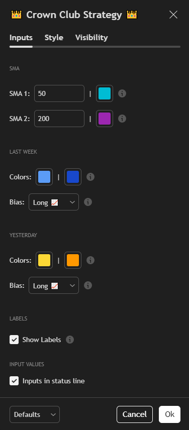

# 👑 Crown Club Strategy Indicator 👑

## 📥 Download the Indicator

Click the button below to download the indicator files in a ZIP:

---

This is the unofficial indicator used by the **Crown Club** community on TradingView.  
It automatically draws:
- 2 SMAs (50 SMA and 200 SMA by default, but you can change in the settings)
- Last Week's High and Low
- Last Week's Fibonacci Levels (0.500, 0.618 and 1.618) and the Golden Zone, based on the bias you set in the settings (Long or Short)
- Yesterday's High and Low
- Yesterday's Fibonacci Levels (0.500, 0.618 and 1.618) and the Golden Zone, based on the bias you set in the settings (Long or Short)

(On Mondays it does not draw Yesterday's High and Low and Fibonacci Levels)

It does not draw:
- FVGs
- Trend Lines

It works on multiple timeframes.

---

## How to Add It to TradingView

1. Open [TradingView](https://tradingview.com) and go to any chart
2. Click on the **Pine Editor** (at the bottom)
3. Delete any default code, then paste the contents of `CrownClubStrategyIndicator.pine`
4. Click the **Add to Chart** button (or `Ctrl + Enter`)
5. Click the **Save** icon and give it a name.
6. You're all set!

---

## How to Use

Once added to your chart, the indicator will automatically plot what we need for this strategy:
- 50 and 200 SMA
- Last Week's High and Low
- Last Week's Fibonacci Levels (0.500, 0.618 and 1.618) and the Golden Zone
- Yesterday's High and Low
- Yesterday's Fibonacci Levels (0.500, 0.618 and 1.618) and the Golden Zone

It will look something like this:

### Settings Overview

If you click the Indicator's **Settings** button:

It will open the Indicator's settings panel:

Where you can customize:
- SMAs length and colors
- Last Week's High/Low colors, Fibonacci Levels colors and the bias (Long or Short)
- Yesterday's High/Low colors, Fibonacci Levels colors and the bias (Long or Short)
- Show/Hide labels

---

## 👑 Join the Crown Club

Want to learn how to trade with this strategy?  
Join the [Crown Club Discord](https://discord.com/invite/crownclubcrypto) for live trading, mentorship and more!

---

## License

This project is licensed under the [Creative Commons Attribution-NonCommercial 4.0 International License](https://creativecommons.org/licenses/by-nc/4.0/).
